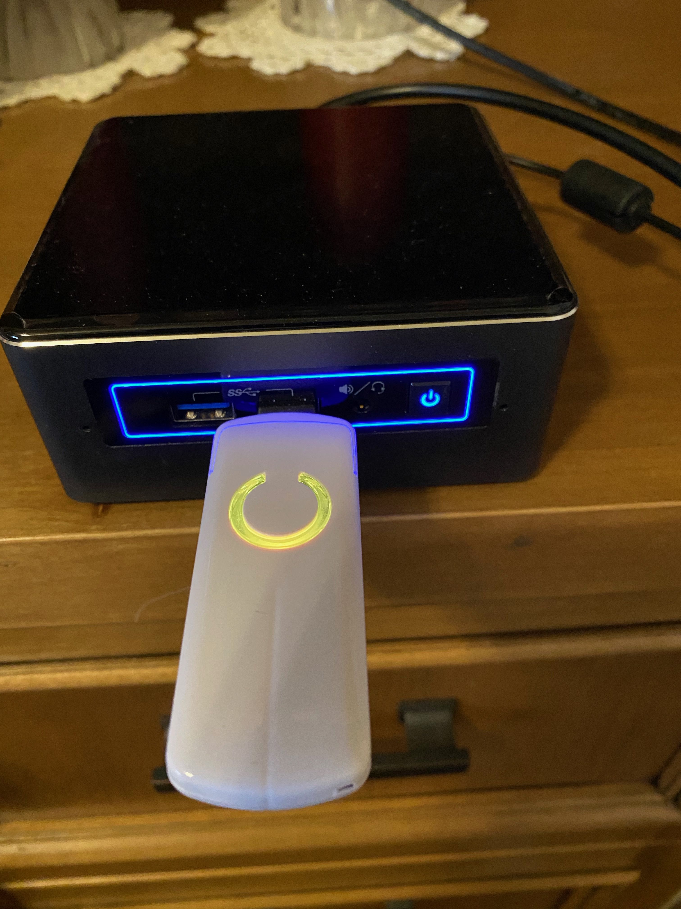

# homeassistant

### Equipment

#### Devices

  - SimplyNUC 8th Generation NUC8i7BEH Server
  - Aeotec z-stick
  - 40 x Leviton DZ155 ZWave Switches
  - 40 x Leviton DZ6HD ZWave Dimmers
  - GE Outdoor ZWave Smart Switch
  - 5 x Aeotec ZWave MultiSensor 6
  - 4 x Sony Bravia 4K TV
  - Sony 4K Projector
  - 4 x Sonos AMP
  - Denon AVR-X4300H Amplifier
  
#### Hardware Images

